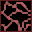
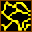
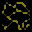
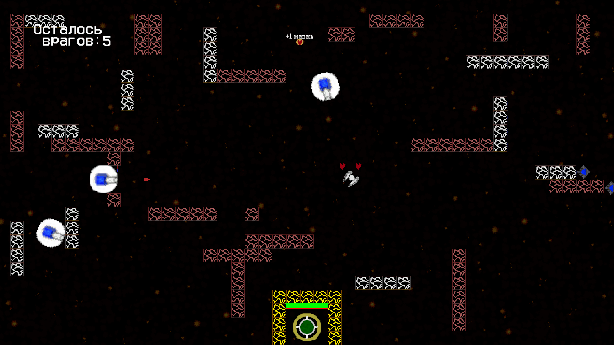
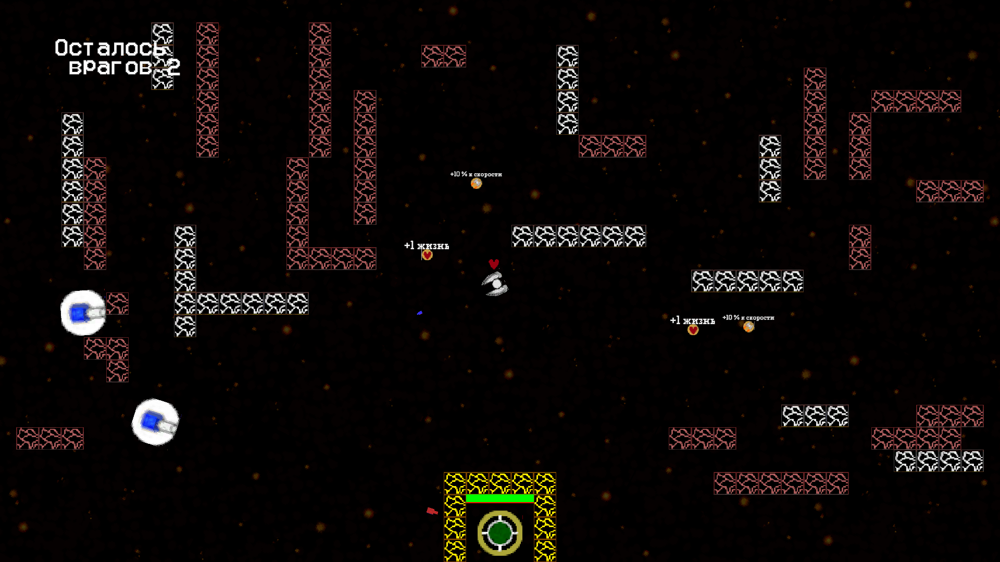
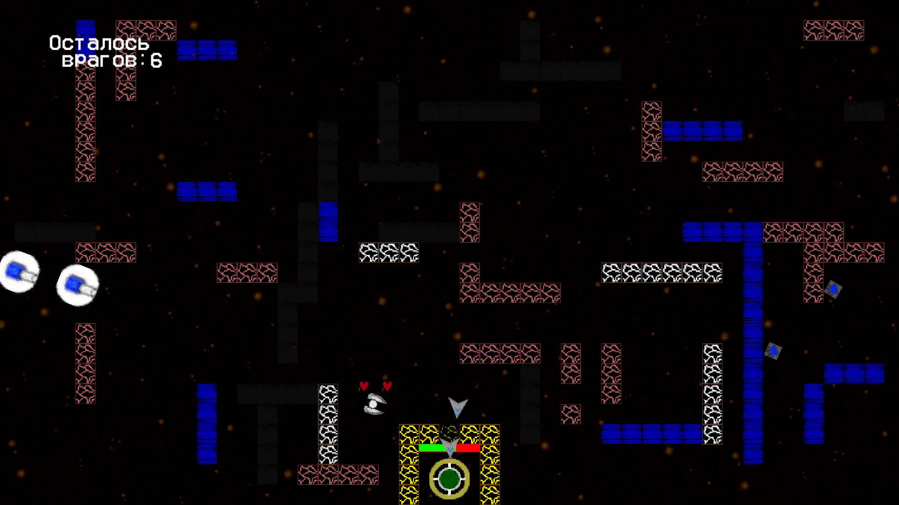
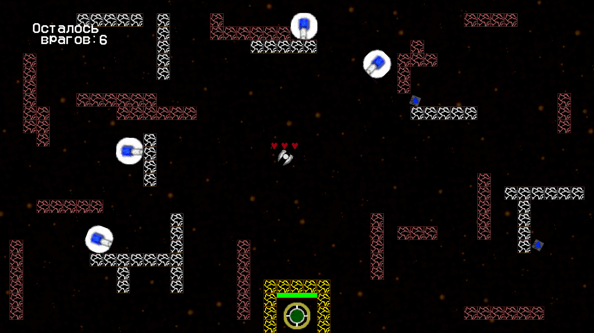

# SpaceBattle
# Цель игры
`Целью игры` является `уничтожение` всех врагов на уровне и `защита` главного корабля, расположенного в нижней части экрана.
# Управление
Для перемещения игрока по карте необходимо использовать клавиши `W` `A` `S` `D`

Направление орудия игрока осущетсвляется `с помощью мыши`. 

Для стрельбы необходимо `удерживать ПКМ`

# Союзники
 
`Корабль игрока` изначально имеет 3 единицы здоровья. Может быть улучшен по ходу игры.

 
`Главный корабль` является объектом защиты для игрока. Уничтожение этого судна ведет к поражению

# Враги
В игре присутствуют враги 3-х видов:
+  
`Circly` - средний корабль, обладающий обычной скоростью передвижения и стрельбы;
+   
`Fasty` - маленький корабль с большой скоростью движения, но с низким запасом здоровья;
+  
`Biggie` - большой корабль с маленькой скоростью атаки и движения, но обладающий внушительным запасом здоровья.
# Бонусы 
В SpaceBattle существует 3 вида бонусов:
+  
`HealthUp` - дает игроку дополнительное здоровье;
+ 
 `SpeedUp` - увеличивает скорость передвижения игрока на 15%;
+  
 `AttackUp` - повышает скорострельность игрока на 15%.
# Препятствия
Бескрайний космос хранит в себе множество препятствий:
+  
`Обычные обломки.` Ломаются при попадании союзного или вражеского снаряда;
+  
`Прочные обломки.` Выдерживают неограниченное количество ударов;
+  
`Солнечный шторм.` Не пропускает через себя корабли, но снаряды беспрепятственно пролетают через него;
+   
`Восстанавливающийся барьер.` Защитные блоки вокруг главного корабля. Восстанавливаются через небольшое время после поражения.
+  
`Туманности.` Мешают обзору игрока и могут скрывать в себе вражеское судно.

# Уровни
Игроку предлагается пройти `12 уровней`, созданных `случайным образом`, но состоящих из `одного и того же набора элементов` при каждой генерации.

# Сохранения 
В игре используются `автосохранения`. Игра сохраняет пройденные уровни при выходе из игры, и автоматически загружает файл сохранения при запуске.

# Скриншоты из игры
 
 
 
 